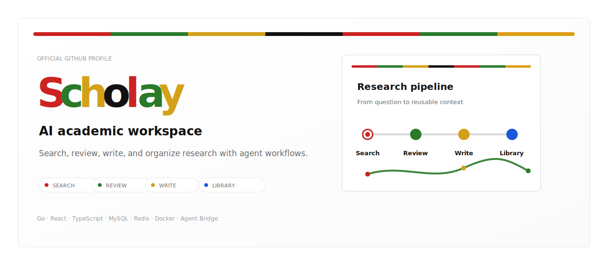
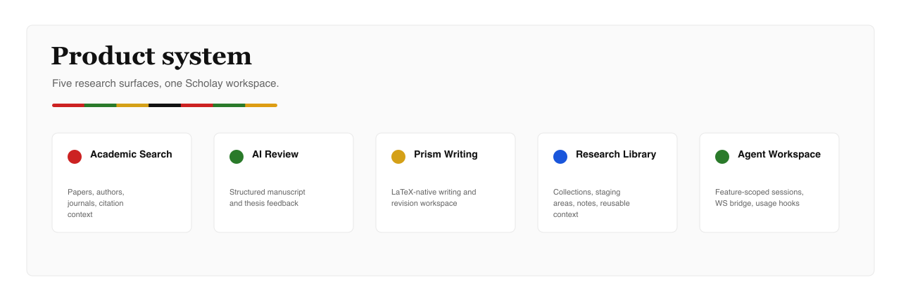
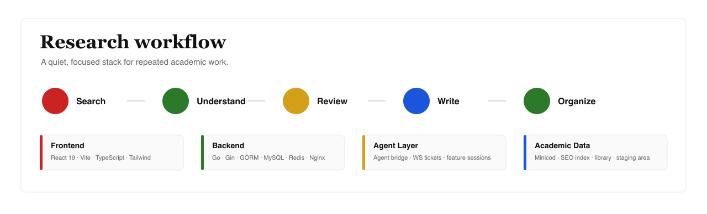
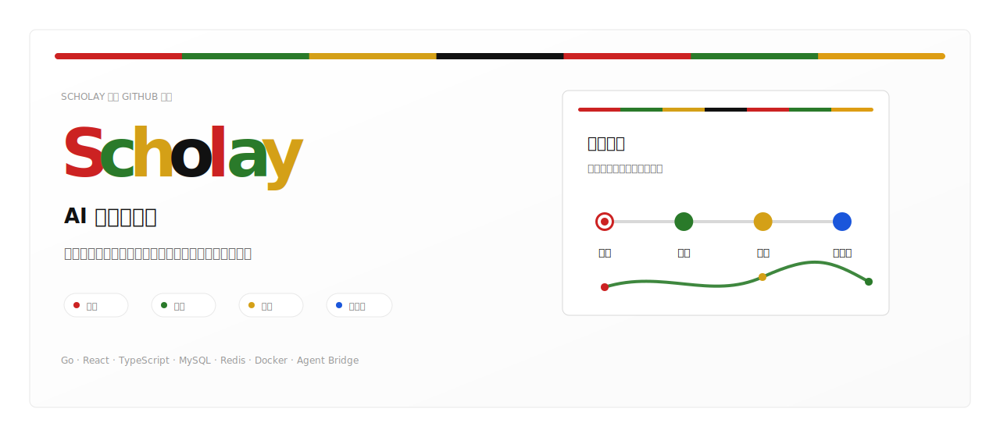
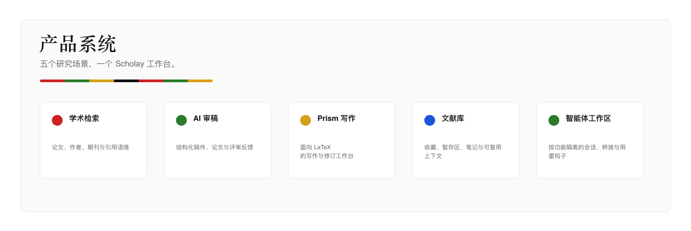
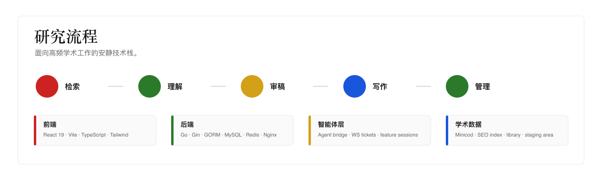

  <a href="#english">English</a>
  ·
  <a href="#中文">中文</a>

  <picture>
    <source media="(prefers-color-scheme: dark)" srcset="./assets/scholay-hero-en-dark.svg">
    
  </picture>

  <a href="https://www.scholay.com">Official Website</a>
  ·
  <a href="https://github.com/scholay">GitHub</a>
  ·
  <strong>AI academic search · review · writing · library</strong>

  <picture>
    <source media="(prefers-color-scheme: dark)" srcset="./assets/scholay-capabilities-en-dark.png">
    
  </picture>

 

  <picture>
    <source media="(prefers-color-scheme: dark)" srcset="./assets/scholay-workflow-en-dark.png">
    
  </picture>

## Scholay

Scholay is building an AI-native academic workspace for researchers, students, editors, and knowledge teams. It brings scholarly search, paper understanding, peer-review assistance, LaTeX writing, and research library workflows into one focused product surface.

## Open Source Preview

Scholay is preparing to open source more of our work. Stay tuned.

If Scholay is valuable to your research workflow, please give us a star.

  <a href="https://www.scholay.com"><strong>www.scholay.com</strong></a>
  ·
  <a href="https://github.com/scholay/scholay/stargazers">Star Scholay on GitHub</a>

## Product Surfaces

- **Academic Search**: fast discovery over papers, authors, journals, and research context.
- **AI Review**: structured peer-review assistance for manuscripts, theses, and journal submissions.
- **Prism Writing**: AI-native LaTeX writing workspace for academic drafting and revision.
- **Research Library**: personal paper collections, staging areas, notes, and reusable context.
- **Agent Workspace**: task-oriented academic agents with search, reasoning, and document context.

## Stack

Go · Gin · MySQL · Redis · React · TypeScript · Vite · Tailwind · Docker · Nginx

---

  <picture>
    <source media="(prefers-color-scheme: dark)" srcset="./assets/scholay-hero-zh-dark.svg">
    
  </picture>

  <a href="https://www.scholay.com">官网</a>
  ·
  <a href="https://github.com/scholay">GitHub</a>
  ·
  <strong>AI 学术检索 · 审稿 · 写作 · 文献库</strong>

  <picture>
    <source media="(prefers-color-scheme: dark)" srcset="./assets/scholay-capabilities-zh-dark.png">
    
  </picture>

 

  <picture>
    <source media="(prefers-color-scheme: dark)" srcset="./assets/scholay-workflow-zh-dark.png">
    
  </picture>

## Scholay

Scholay 正在构建面向研究者、学生、编辑和知识团队的 AI 原生学术工作台。它把学术检索、论文理解、同行评审辅助、LaTeX 写作和个人文献库流程整合到一个专注的产品界面里。

## 开源预告

Scholay 正在准备逐步开源，敬请期待。

如果我们的产品对你有价值，欢迎给我们一个 Star。

  <a href="https://www.scholay.com"><strong>www.scholay.com</strong></a>
  ·
  <a href="https://github.com/scholay/scholay/stargazers">给 Scholay 一个 Star</a>

## 产品矩阵

- **学术检索**：面向论文、作者、期刊与研究语境的快速检索。
- **AI 审稿**：为论文、学位论文和投稿稿件提供结构化评审辅助。
- **Prism 写作**：面向 LaTeX 的 AI 原生学术写作与修订工作台。
- **文献库**：个人文献集、检索暂存区、笔记和可复用研究上下文。
- **智能体工作区**：面向任务的学术智能体，结合检索、推理与文档上下文。

## 技术栈

Go · Gin · MySQL · Redis · React · TypeScript · Vite · Tailwind · Docker · Nginx

  Scholay brand system: Playfair Display wordmark · Inter UI · #CC2222 · #2A7A2A · #D4A017 · #111111

