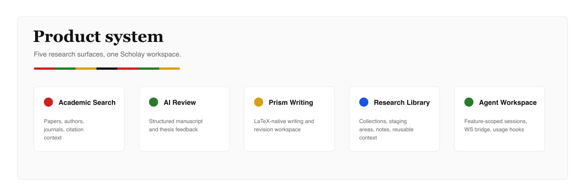
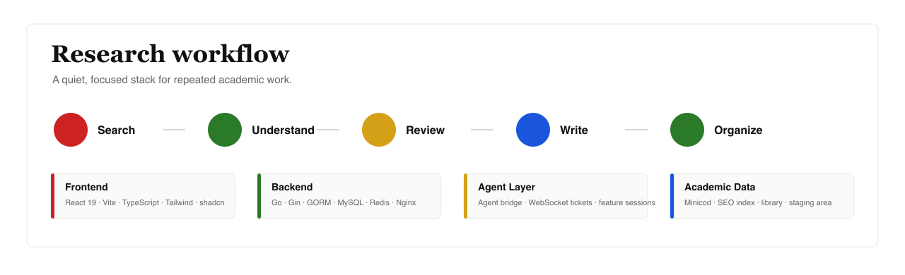

  <picture>
    <source media="(prefers-color-scheme: dark)" srcset="./assets/scholay-hero-dark.png">
    
  </picture>

  <a href="https://www.scholay.com">Official Website</a>
  ·
  <a href="https://github.com/scholay">GitHub</a>
  ·
  <strong>AI academic search · review · writing · library</strong>

  <picture>
    <source media="(prefers-color-scheme: dark)" srcset="./assets/scholay-capabilities-dark.png">
    
  </picture>

 

  <picture>
    <source media="(prefers-color-scheme: dark)" srcset="./assets/scholay-workflow-dark.png">
    
  </picture>

## Scholay

Scholay is building an AI-native academic workspace for researchers, students, editors, and knowledge teams. It brings scholarly search, paper understanding, peer-review assistance, LaTeX writing, and research library workflows into one focused product surface.

## Product Surfaces

- **Academic Search**: fast discovery over papers, authors, journals, and research context.
- **AI Review**: structured peer-review assistance for manuscripts, theses, and journal submissions.
- **Prism Writing**: AI-native LaTeX writing workspace for academic drafting and revision.
- **Research Library**: personal paper collections, staging areas, notes, and reusable context.
- **Agent Workspace**: task-oriented academic agents with search, reasoning, and document context.

## Stack

Go · Gin · MySQL · Redis · React · TypeScript · Vite · Tailwind · Docker · Nginx

  Scholay brand system: Playfair Display wordmark · Inter UI · #CC2222 · #2A7A2A · #D4A017 · #111111

