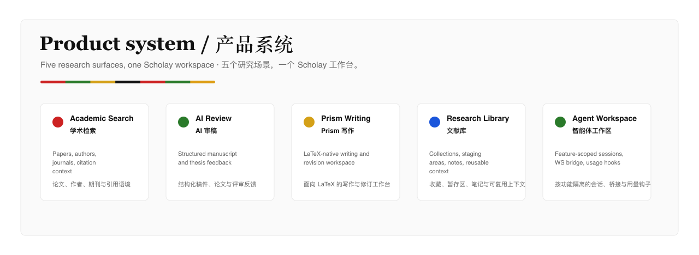

  <picture>
    <source media="(prefers-color-scheme: dark)" srcset="./assets/scholay-hero-animated-stable-dark.svg">
    
  </picture>

  <a href="https://www.scholay.com">Official Website / 官网</a>
  ·
  <a href="https://github.com/scholay">GitHub</a>
  ·
  <strong>AI academic search · review · writing · library / AI 学术检索 · 审稿 · 写作 · 文献库</strong>

  <a href="#english">English</a>
  ·
  <a href="#简体中文">简体中文</a>

  <picture>
    <source media="(prefers-color-scheme: dark)" srcset="./assets/scholay-capabilities-multilingual-dark.png">
    
  </picture>

 

  <picture>
    <source media="(prefers-color-scheme: dark)" srcset="./assets/scholay-workflow-multilingual-dark.png">
    
  </picture>

## English

Scholay is building an AI-native academic workspace for researchers, students, editors, and knowledge teams. It brings scholarly search, paper understanding, peer-review assistance, LaTeX writing, and research library workflows into one focused product surface.

## Product Surfaces / 产品矩阵

| Surface | English | 简体中文 |
| --- | --- | --- |
| Academic Search | Fast discovery over papers, authors, journals, and research context. | 面向论文、作者、期刊与研究语境的快速学术检索。 |
| AI Review | Structured peer-review assistance for manuscripts, theses, and journal submissions. | 为论文、学位论文和投稿稿件提供结构化 AI 审稿辅助。 |
| Prism Writing | AI-native LaTeX writing workspace for academic drafting and revision. | 面向 LaTeX 的 AI 原生学术写作与修订工作台。 |
| Research Library | Personal paper collections, staging areas, notes, and reusable context. | 个人文献集、检索暂存区、笔记和可复用研究上下文。 |
| Agent Workspace | Task-oriented academic agents with search, reasoning, and document context. | 面向任务的学术智能体，结合检索、推理与文档上下文。 |

## 简体中文

Scholay 正在构建面向研究者、学生、编辑和知识团队的 AI 原生学术工作台。它把学术检索、论文理解、同行评审辅助、LaTeX 写作和个人文献库流程整合到一个专注的产品界面里。

## Stack / 技术栈

Go · Gin · MySQL · Redis · React · TypeScript · Vite · Tailwind · Docker · Nginx

  Scholay brand system / 品牌系统: Playfair Display wordmark · Inter UI · #CC2222 · #2A7A2A · #D4A017 · #111111

